# Solución Ejercicio Liquibase

1. Utilice el motor de base de datos relacional de su preferencia (MySQL, PostgreSQL, etc).

```
    liquibase.command.url=jdbc:mysql://localhost:3306/shoes
```

2. Estructure su proyecto de Liquibase conforme a las mejores prácticas y configure el archivo properties con los parámetros necesarios.

   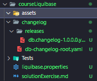

   ```yml
       # Enter the path for your changelog file.
       changeLogFile=./changelog/db-changelog-root.yaml

       #### Enter the Target database 'url' information  ####
       # liquibase.command.url=jdbc:postgresql://localhost:5432/Formularios
       liquibase.command.url=jdbc:mysql://localhost:3306/shoes

       # Enter the username for your Target database.
       liquibase.command.username: root

       # Enter the password for your Target database.
       liquibase.command.password: root
   ```

3. Generar un changelog con sus changesets para crear una tabla en un esquema de base de datos nuevo, la tabla deberá tener al menos 5 atributos. Ejecute los comandos updateSQL y validate antes de ejecutar el comando update.

## Esquema

```yaml
    databaseChangeLog:
  - changeSet:
      id: 260724-1
      author: jared.trejo
      changes:
        - createTable:
            tableName: shoes
            columns:
              - column:
                  name: id
                  type: int
                  constraints:
                    primaryKey: true
                    nullable: false
              - column:
                  name: marca
                  type: varchar(255)
                  constraints:
                    nullable: false
              - column:
                  name: modelo
                  type: varchar(255)
                  constraints:
                    nullable: false
              - column:
                  name: talla
                  type: decimal(5,2)
                  constraints:
                    nullable: false
              - column:
                  name: color
                  type: varchar(50)
                  constraints:
                    nullable: false
              - column:
                  name: precio
                  type: decimal(10,2)
                  constraints:
                    nullable: false
```

## updateSQL

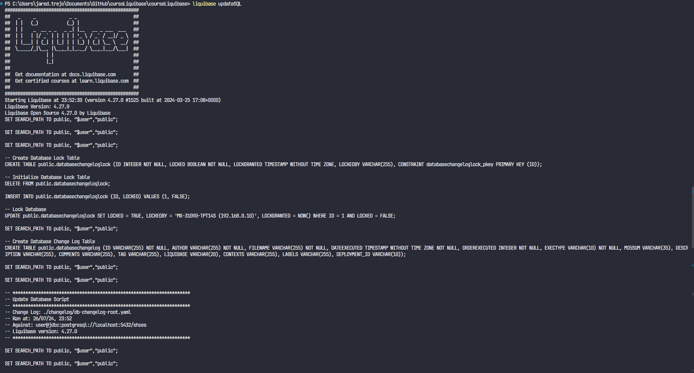

## validate

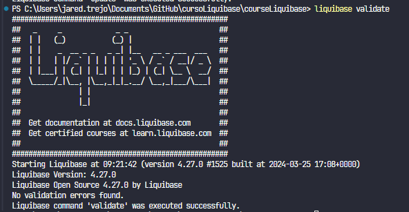

## update

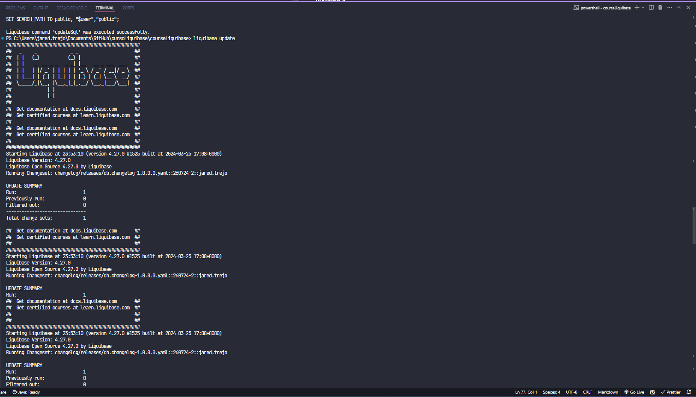

## Generación de base de datos

4. Generar la tabla anterior en otra base de datos nueva.

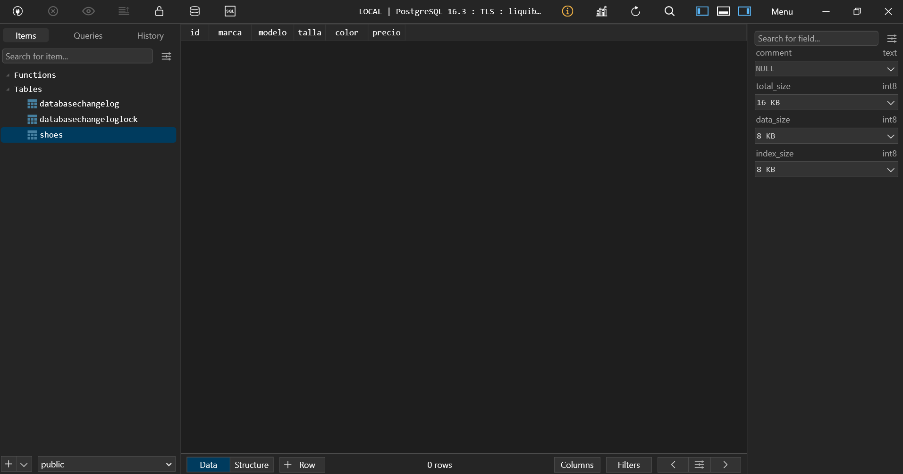

5. Generar una nueva tabla con 6 atributos en la base de datos del paso número 3.

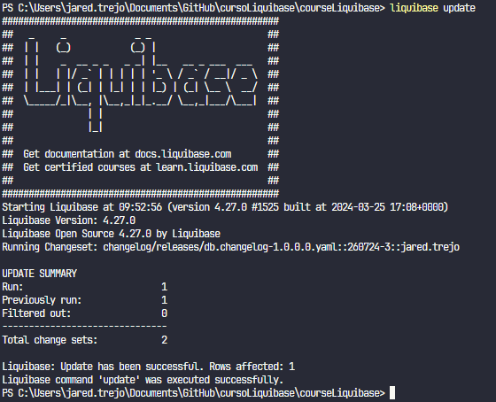

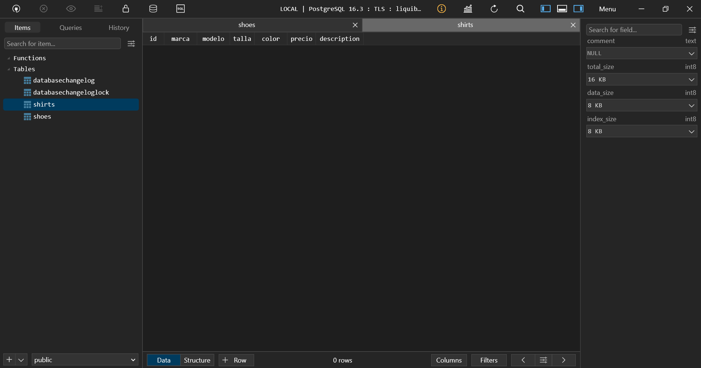

6. Modifique algunos de los atributos en la tabla del paso número 3.

```yaml
- changeSet:
  id: 260724-4
  author: jared.trejo
  changes:
    - modifyDataType:
        tableName: shoes
        columnName: marca
        newDataType: varchar(100)
    - modifyDataType:
        tableName: shoes
        columnName: precio
        newDataType: decimal(12,2)
```

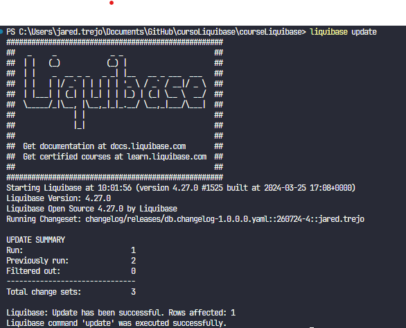

7. Ejecute los comandos history y status.

## Comando history

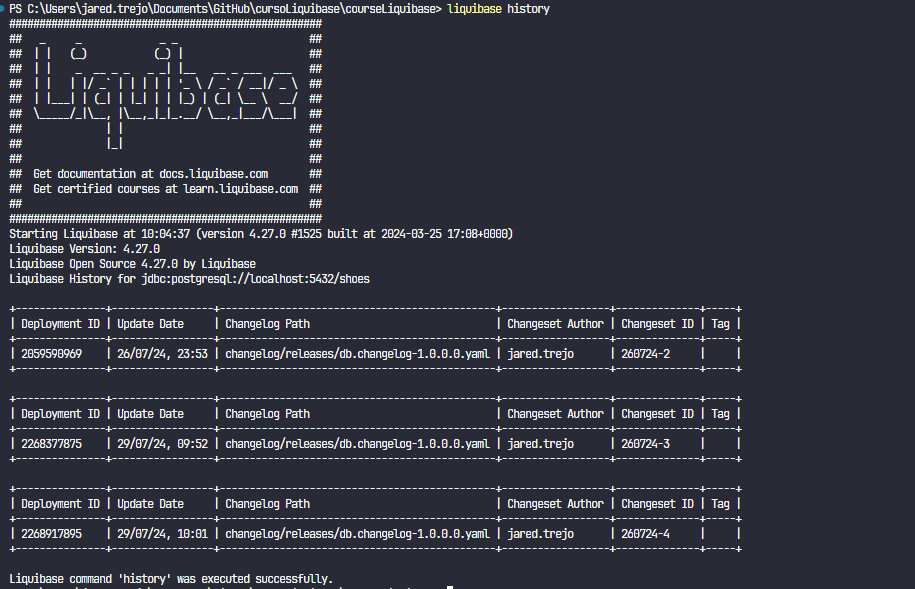

## Comando status

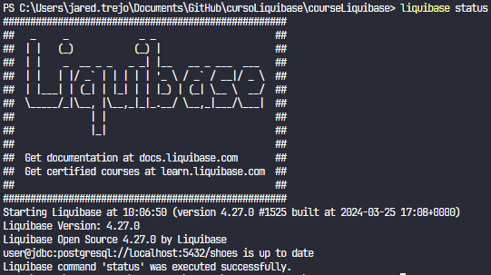

8. Realizar una operación de rollback en la base de datos del punto número 3.

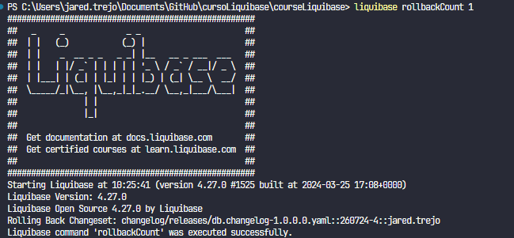

9. Generar un stored procedure en la base de datos del punto número 4.

```yaml
- changeSet:
  id: 260724-5
  author: jared.trejo
  changes:
    - createProcedure:
        procedureName: insert_shirt
        procedureBody: |
          CREATE OR REPLACE FUNCTION insert_shirt(
            p_marca VARCHAR(255),
            p_modelo VARCHAR(255),
            p_talla DECIMAL(5,2),
            p_color VARCHAR(50),
            p_precio DECIMAL(10,2),
            p_description VARCHAR(255)
          )
          RETURNS VOID AS $$
          BEGIN
            INSERT INTO shirts (marca, modelo, talla, color, precio, descripcion)
            VALUES (p_marca, p_modelo, p_talla, p_color, p_precio, p_description);
          END;
          $$ LANGUAGE plpgsql;

  rollback:
    - sql:
        string: DROP PROCEDURE IF EXISTS insert_shirt;
```

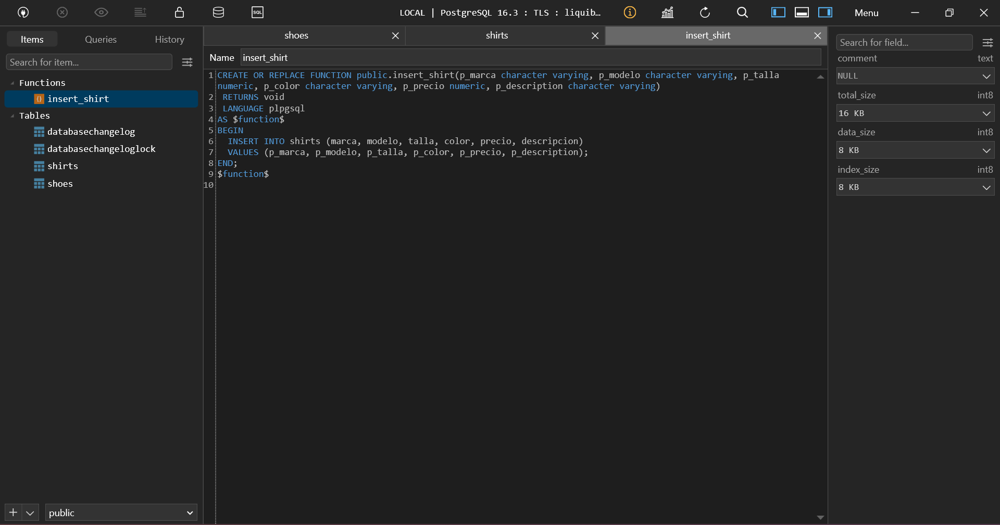

10. Generar un changelog con el comando generateChangeLog desde la base de datos existente del punto número 3.

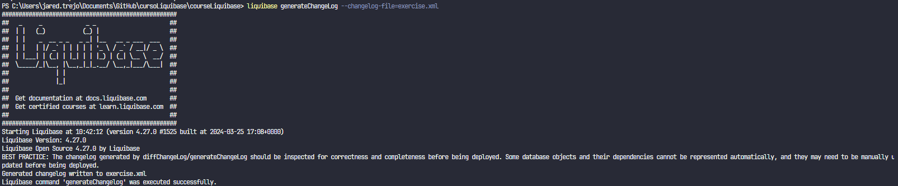

```xml
    <?xml version="1.1" encoding="UTF-8" standalone="no"?>
<databaseChangeLog xmlns="http://www.liquibase.org/xml/ns/dbchangelog" xmlns:ext="http://www.liquibase.org/xml/ns/dbchangelog-ext" xmlns:pro="http://www.liquibase.org/xml/ns/pro" xmlns:xsi="http://www.w3.org/2001/XMLSchema-instance" xsi:schemaLocation="http://www.liquibase.org/xml/ns/dbchangelog-ext http://www.liquibase.org/xml/ns/dbchangelog/dbchangelog-ext.xsd http://www.liquibase.org/xml/ns/pro http://www.liquibase.org/xml/ns/pro/liquibase-pro-latest.xsd http://www.liquibase.org/xml/ns/dbchangelog http://www.liquibase.org/xml/ns/dbchangelog/dbchangelog-latest.xsd">
    <changeSet author="jared.trejo (generated)" id="1722271333969-1">
        <createTable tableName="shirts">
            <column name="id" type="INTEGER">
                <constraints nullable="false" primaryKey="true" primaryKeyName="shirts_pkey"/>
            </column>
            <column name="marca" type="VARCHAR(255)">
                <constraints nullable="false"/>
            </column>
            <column name="modelo" type="VARCHAR(255)">
                <constraints nullable="false"/>
            </column>
            <column name="talla" type="numeric(5, 2)">
                <constraints nullable="false"/>
            </column>
            <column name="color" type="VARCHAR(50)">
                <constraints nullable="false"/>
            </column>
            <column name="precio" type="numeric(10, 2)">
                <constraints nullable="false"/>
            </column>
            <column name="description" type="VARCHAR(255)">
                <constraints nullable="false"/>
            </column>
        </createTable>
    </changeSet>
    <changeSet author="jared.trejo (generated)" id="1722271333969-2">
        <createTable tableName="shoes">
            <column name="id" type="INTEGER">
                <constraints nullable="false" primaryKey="true" primaryKeyName="shoes_pkey"/>
            </column>
            <column name="marca" type="VARCHAR(100)">
                <constraints nullable="false"/>
            </column>
            <column name="modelo" type="VARCHAR(255)">
                <constraints nullable="false"/>
            </column>
            <column name="talla" type="numeric(5, 2)">
                <constraints nullable="false"/>
            </column>
            <column name="color" type="VARCHAR(50)">
                <constraints nullable="false"/>
            </column>
            <column name="precio" type="numeric(12, 2)">
                <constraints nullable="false"/>
            </column>
        </createTable>
    </changeSet>
</databaseChangeLog>

```
