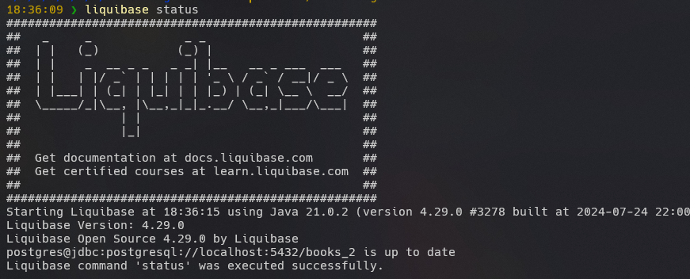

# Ejercicio con Liquibase

Con los conocimientos y conceptos adquiridos en el curso se pide lo siguiente:

1.- **Utilice el motor de base de datos relacional de su preferencia (MySQL, PostgreSQL, etc).
Estructure su proyecto de Liquibase conforme a las mejores prácticas y configure el archivo properties con los parámetros necesarios.**

[liquibase.properties](./liquibase.properties)


1.- **Generar un changelog con sus changesets para crear una tabla en un esquema de base de datos nuevo, la tabla deberá tener al menos 5 atributos.**
[changelog](./changelog/changelogs/db.changelog-1.0.0.0.yaml)
```yml
databaseChangeLog:
- changeSet:
    id: 26072024-1
    author: Daniel.Aguilar
    changes:
    - createTable:
        columns:
        - column:
            autoIncrement: true
            constraints:
              nullable: false
              primaryKey: true
              primaryKeyName: PK_c_authors
            name: id
            type: INTEGER
        - column:
            constraints:
              nullable: false
            name: fullname
            type: VARCHAR(50)
        - column:
            constraints:
              nullable: false
            name: pseudonym
            type: VARCHAR(20)
        - column:
            constraints:
              nullable: false
            name: country
            type: VARCHAR(20)
        - column:
            constraints:
              nullable: false
            name: fg_active
            type: BOOLEAN
        tableName: k_authors
```

2.- **Ejecute los comandos updateSQL y validate antes de ejecutar el comando update.**


3.- **Generar la tabla anterior en otra base de datos nueva.**

```properties
#Se ha generado en una BD llamada books_2
liquibase.command.url=jdbc:postgresql://localhost:5432/books_2
```


4.- **Generar una nueva tabla con 6 atributos en la base de datos del paso número 3.**

```yaml
# en db.changelog-1.0.0.0.yml
- changeSet:
    id: 26072024-2
    author: Daniel.Aguilar
    changes:
    - createTable:
        columns:
        - column:
            autoIncrement: true
            constraints:
              nullable: false
              primaryKey: true
              primaryKeyName: PK_c_editoriales
            name: id
            type: INTEGER
        - column:
            constraints:
              nullable: false
            name: name
            type: VARCHAR(50)
        - column:
            constraints:
              nullable: false
            name: ubicacion
            type: VARCHAR(100)
        - column:
            constraints:
              nullable: false
            name: logo
            type: VARCHAR(20)
        - column:
            constraints:
              nullable: false
            name: fecha_apertura
            type: DATE
        - column:
            constraints:
              nullable: false
            name: fg_active
            type: BOOLEAN
        tableName: k_authors
```


5.- **Modifique algunos de los atributos en la tabla del paso número 3.**

```yaml
databaseChangeLog:
- changeSet:
    id: 26072024-3
    author: Daniel.Aguilar
    changes:
    - modifyDataType:
      tableName: k_authors
      columnName: fullname
      newDataType: VARCHAR(30)
```

6.- **Ejecute los comandos history y status.**
```bash
liquibase history
```


```bash
liquibase status
```


7.- **Realizar una operación de rollback en la base de datos del punto número 3.**

Se agrego el siguiente changeset
```yaml
- changeSet:
    id: 26072024-4
    author: Daniel.Aguilar
    changes:
    - addColumn:
        tableName: k_authors
        columns:
        - column:
            name: favorite_book
            type: VARCHAR(20)
```


8.- **Generar un stored procedure en la base de datos del punto número 4.**

[Store procedure creado](./changelog/changelogs/store-procedures/insert_on_editorial.sql)
```sql
CREATE OR REPLACE FUNCTION insert_editorial(
    p_name VARCHAR,
    p_ubicacion VARCHAR,
    p_logo VARCHAR,
    p_fecha_apertura DATE,
    p_fg_active BOOLEAN
)
RETURNS VOID AS $$
BEGIN
    INSERT INTO editorial (name, ubicacion, logo, fecha_apertura, fg_active)
    VALUES (p_name, p_ubicacion, p_logo, p_fecha_apertura, p_fg_active);
END;

$$ LANGUAGE plpgsql;
```

Se agrego un changeset:
```yaml
- changeSet:
    id: 26072024-5
    author: Daniel.Aguilar
    changes:
    - createProcedure:
        tableName: k_authors
        procedureName: insert_editorial
        path: ./store-procedures/insert_on_editorial.sql
        stripComments: true
        splitStatements: true
        relativeToChangelogFile: true
```


9.- **Generar un changelog con el comando generateChangeLog desde la base de datos existente del punto número 3.**


[Archivo Generado](changelog_generated.xml)

```xml
<?xml version="1.1" encoding="UTF-8" standalone="no"?>
<databaseChangeLog xmlns="http://www.liquibase.org/xml/ns/dbchangelog" xmlns:ext="http://www.liquibase.org/xml/ns/dbchangelog-ext" xmlns:pro="http://www.liquibase.org/xml/ns/pro" xmlns:xsi="http://www.w3.org/2001/XMLSchema-instance" xsi:schemaLocation="http://www.liquibase.org/xml/ns/dbchangelog-ext http://www.liquibase.org/xml/ns/dbchangelog/dbchangelog-ext.xsd http://www.liquibase.org/xml/ns/pro http://www.liquibase.org/xml/ns/pro/liquibase-pro-latest.xsd http://www.liquibase.org/xml/ns/dbchangelog http://www.liquibase.org/xml/ns/dbchangelog/dbchangelog-latest.xsd">
    <changeSet author="Daniel.Aguilar (generated)" id="1722042271694-1">
        <createTable tableName="k_authors">
            <column autoIncrement="true" name="id" type="INTEGER">
                <constraints nullable="false" primaryKey="true" primaryKeyName="PK_c_authors"/>
            </column>
            <column name="fullname" type="VARCHAR(30)">
                <constraints nullable="false"/>
            </column>
            <column name="pseudonym" type="VARCHAR(20)">
                <constraints nullable="false"/>
            </column>
            <column name="country" type="VARCHAR(20)">
                <constraints nullable="false"/>
            </column>
            <column name="fg_active" type="BOOLEAN">
                <constraints nullable="false"/>
            </column>
            <column name="favorite_book" type="VARCHAR(20)"/>
        </createTable>
    </changeSet>
    <changeSet author="Daniel.Aguilar (generated)" id="1722042271694-2">
        <createTable tableName="k_editoriales">
            <column autoIncrement="true" name="id" type="INTEGER">
                <constraints nullable="false" primaryKey="true" primaryKeyName="PK_c_editoriales"/>
            </column>
            <column name="name" type="VARCHAR(50)">
                <constraints nullable="false"/>
            </column>
            <column name="ubicacion" type="VARCHAR(100)">
                <constraints nullable="false"/>
            </column>
            <column name="logo" type="VARCHAR(20)">
                <constraints nullable="false"/>
            </column>
            <column name="fecha_apertura" type="date">
                <constraints nullable="false"/>
            </column>
            <column name="fg_active" type="BOOLEAN">
                <constraints nullable="false"/>
            </column>
        </createTable>
    </changeSet>
</databaseChangeLog>

```